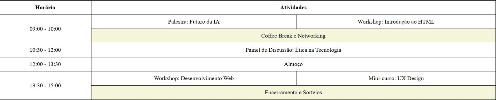

# Atividade - Etapa 2: Introdução ao HTML e Tabelas

Dando continuidade ao aprendizado, iniciaremos um dos pilares fundamentais do conhecimento explorado neste processo: o **HTML**! O HTML (Hypertext Markup Language - Linguagem de Marcação de Hipertexto) é a tecnologia usada para estruturar páginas web, sendo a base de tudo o que visualizamos na internet.

Para aplicar esse conhecimento, você desenvolverá um pequeno código em HTML, criando uma tabela simples para representar um cronograma de eventos. Para darmos prosseguimento na etapa, entre no link abaixo e entre no **GitHub Classroom** (como na etapa anterior) e identifique seu nome! Será por lá a entrega dessa tarefa!

## Habilidades a Serem Desenvolvidas

Nesta atividade, desenvolveremos as seguintes habilidades:

- HTML: Conceitos Gerais
- HTML: Utilizando "tables" (tabelas)


## Atividade Prática

Nesta atividade, você deverá criar uma tabela representando um cronograma de eventos. A tabela deve conter informações como horários, descrições, eventos simultâneos, entre outros.

Para isso, siga o modelo apresentado na imagem abaixo:



Utilizando os conceitos aprendidos, crie uma tabela que atenda às necessidades propostas e proporcione uma boa visualização dos eventos, destacando horários simultâneos e informações específicas. Após finalizar o código, envie-o para o link fornecido do **GitHub Classroom**.

## Ferramentas Utilizadas

- **HTML**: Construção da estrutura da tabela
- **GitHub, GitHub Classroom e GitHub Codespace**: Local onde o código será armazenado e corrigido pela equipe

## Critérios de Avaliação

A entrega será validada por meio do **GitHub Classroom**, garantindo que todas as etapas tenham sido concluídas corretamente. Os seguintes aspectos serão avaliados:

- ✅ **Arquivo com extensão ".html"** presente;
- ✅ **Uso correto das tags**: "table", "tr", "td" e "th";
- ✅ **Aplicação de estilizações básicas**, como: "border", "caption", "colspan" e "rowspan".

## Como Usar as Tags de Tabela em HTML

### 1. **Tag `<table>`**

A tag `<table>` define uma tabela em HTML. Ela é a estrutura principal onde você irá inserir as linhas e células da tabela. O código básico seria:

```html
<table>
  <!-- As linhas e células serão inseridas dentro dessa tag -->
</table>
```

### 2. **Tag `<tr>` (Table Row)**

A tag `<tr>` define uma linha dentro da tabela. Cada `<tr>` pode conter várias células, como `<td>` ou `<th>`. Exemplo:

```html
<tr>
  <td>Evento 1</td>
  <td>10:00</td>
</tr>
```

### 3. **Tag `<td>` (Table Data)**

A tag `<td>` é usada para definir as células de dados dentro de uma linha. Cada `<td>` contém uma informação específica, como um nome de evento ou horário. Exemplo:

```html
<td>Evento 1</td>
<td>10:00</td>
```

### 4. **Tag `<th>` (Table Header)**

A tag `<th>` define uma célula de cabeçalho dentro da tabela. Ela é usada geralmente na primeira linha para indicar os títulos das colunas. Exemplo:

```html
<th>Evento</th>
<th>Hora</th>
```

### 5. **Atributos de Estilização**

Você pode aplicar algumas estilizações básicas às tabelas, como:

- **`border`**: Para adicionar bordas às células.
- **`caption`**: Para adicionar um título à tabela.
- **`colspan`**: Para combinar células em uma coluna.
- **`rowspan`**: Para combinar células em uma linha.

Exemplo de estilização:

```html
<table border="1">
  <caption>Cronograma de Eventos</caption>
  <tr>
    <th>Evento</th>
    <th>Hora</th>
  </tr>
  <tr>
    <td>Evento 1</td>
    <td>10:00</td>
  </tr>
</table>
```
**Importante:** A estrutura acima é só um exemplo! A sua submissão deve ser muito mais desenvolvida e estilizada.

